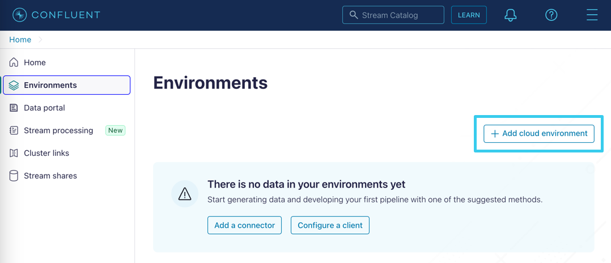
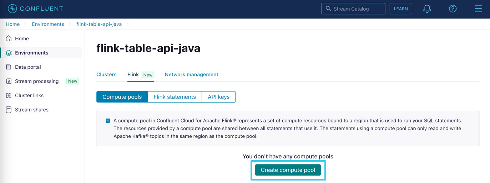
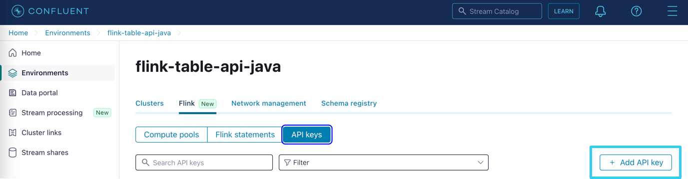

# Connecting the Apache Flink Table API to Confluent Cloud (Exercise) 

In this exercise, we will set up Confluent Cloud and establish a connection from a Flink application to the cluster. In future exercises, we'll expand on this Flink application to produce various queries focused on an online marketplace.

## Create a Confluent Cloud account and log in.

**NOTE:** If you already have a Confluent Cloud account, you can skip this step.

- Go to [Confluent Cloud signup page](https://www.confluent.io/confluent-cloud/tryfree/) and create a new account.
- Watch your inbox for a confirmation email and follow the link to proceed.
- You will be asked to create a cluster. Feel free to ignore this. We don't need a cluster for the moment.

## Install the Confluent CLI

Many of the steps below are easier when completed from the command line. While it's not required, you may want to install the Confluent CLI by following the instructions here:

[Install the Confluent CLI](https://docs.confluent.io/confluent-cli/current/overview.html)

If you prefer to use the CLI, refer to the **Command Line Reference** sections after each set of instructions.

## Create an environment.

We will create a cloud environment specifically for this course. This will ensure isolation and allow for easy cleanup.

**NOTE:** Use the same cloud and region throughout this setup. Using different clouds or regions could impact performance and result in additional costs.

**WARNING:** Do not use a production environment for this course. Use a new environment with new credentials. You don't want to accidentally compromise your production environment.



- From the **Environments** menu click **+ Add cloud environment**.
- Name your environment `flink-table-api-java`.
- Use the **Essentials** Stream Governance package.
- You will be asked to create a cluster. Choose **I'll do it later**.

### Command Line Reference

Create the environment.

```
confluent environment create flink-table-api-java
```

Set the active environment.

```
confluent environment use <environment id>
```

Enable the schema registry (adjust cloud and geo settings as required).

```
confluent schema-registry cluster enable --cloud gcp --geo us --package essentials
```

## Create a compute pool.

Flink uses compute resources and requires a compute pool. Let's create one.



- Inside the `flink-table-api-java` environment, select **Flink** -> **Compute Pools** and click **Create compute pool**.
- Select an appropriate cloud and region.
- Give your pool the name `marketplace-compute`.

### Command Line Reference

Create a compute pool (adjust cloud and region settings as required).

```
confluent flink compute-pool create marketplace-compute --cloud gcp --region us-central1 --max-cfu 10
```

## Create an Apache Flink API key.

To access Flink in Confluent Cloud, we need an API key.



- Still in the **Flink** tab, select **API Keys** and click **Add API key**.
- Use the **My Access** key type.
	- **NOTE:** **Granular Access** is recommended for production.
- Add an appropriate name and description (eg. `marketplace-api-key`) for the key.
- Download and save the key somewhere that you can access it later.

### Command Line Reference

Create a Flink API Key (adjust cloud and region settings as required).

**NOTE:** Save the key and secret for later.

```
confluent api-key create --resource flink --cloud gcp --region us-central1
```

## Download the Table API plugin.

**NOTE:** This step is temporary. Once the plugin has been released this will not be required.

- Clone the `confluent-flink-plugin` from [Github](https://github.com/confluentinc/confluent-flink-plugin-private)
- Run the following command from the repository:

  ```
  mvn clean install
  ```

## Download the code.

Now that we have an environment, we need an application to connect to it. If you haven't already done so clone the Github repo:

[Clone it on Gitub](https://github.com/confluentinc/learn-apache-flink-table-api-for-java-exercises)

You will need a suitable Java development environment including:

- Java 17
- Maven
- An IDE such as IntelliJ, Eclipse, or VS Code.

To easily switch between Java versions, you can use [SDKMAN](https://sdkman.io/).

## Stage the exercise.

Inside the `exercises` folder locate the `README.md` file. Open that file and read the instructions. When you are done, stage the exercise by executing:

```
./exercise.sh stage 03
```

## Obtain configuration settings.

Connecting to the environment will require some configuration settings. Some of them are available from previous steps. Follow the instructions below to obtain the others.

- Cloud and Region (determined above).
- Flink API Key and Secret (created above).
- **Environment Id** (starts with `env-`):
	- Select the environment and look for the ID field. 
	- **Command Line Reference:**
	
	  ```
	  confluent environment list
	  ```

- **Compute Pool Id** (starts with `lfcp-`):
	- Select the compute pool and look for the ID field.
	- **Command Line Reference:**
  
	  ```
	  confluent flink compute-pool list
	  ```
  
- **Organization Id** (a GUID/UUID)	
	- From the menu in the top right hand corner, select **Organization Settings** and look for the organization Id.
	- **Command Line Reference:**
  
	  ```
	  confluent org list
	  ```

- **User Id** (starts with `u-`):
	- From the menu in the top right-hand corner, select **Accounts & access** and look for your user Id.
	- **Command Line Reference:** 
  
	  ```
	  confluent iam user list
	  ```
	  
## Configure the application.  

Next, we need to enter the configuration parameters into our application.
  
- Import the project (Maven POM file) from the `exercises` folder into your IDE.
- Locate the file `src/main/resources/cloud.properties`.
- Replace the placeholder values with the configuration parameters from above.

## Build the Application

Confluent Cloud includes a read-only set of Flink tables in a sandbox-link environment. These tables can be used for experimentation and testing. For a simple test of the connection parameters, we can ask the Table API to list those tables.

- In `src/main/java/marketplace` create a class named `Marketplace`.
- Implement a Java `main` method.
- Use the `ConfluentSettings` class to load the configuration from the `/cloud.properties` file:
	
	```
	EnvironmentSettings settings = ConfluentSettings.newBuilder(<Properties File Name>).build();
	```
- Create a new table environment using the settings:
  
  ```
  TableEnvironment env = TableEnvironment.create(settings);
  ```

- Set the catalog to `examples` and the database to `marketplace`.

  ```
  env.useCatalog(<Catalog Name>);
  env.useDatabase(<Database Name>);
  ```
  
- Use `env.listTables()` to produce a list of tables in the database and print the results.

## Run the application.

- In a terminal, execute the application by running the commands:

  ```
  mvn clean package
  java -jar target/flink-table-api-marketplace-0.1.jar
  ```

- Assuming you have done everything correctly you should see the following tables printed:
	- clicks
	- customers
	- orders
	- products

## Finish

This brings us to the end of this exercise.