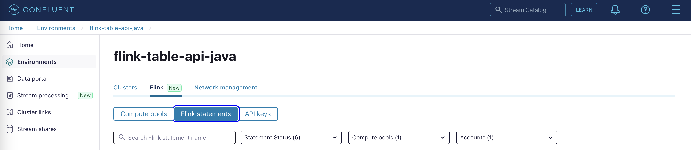
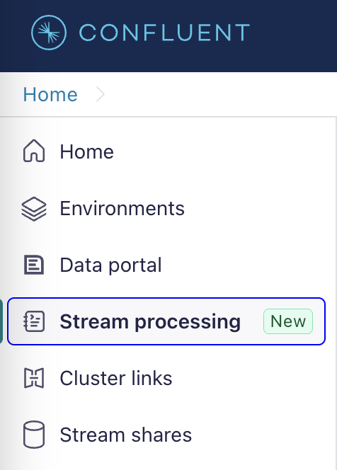

# Querying Flink Tables with the Table API (Exercise) 

In this exercise, we will execute some Flink Table API queries using the built-in Marketplace tables in Confluent Cloud.

We'll start with basic select statements to set a foundation for future exercises.

## Stage the exercise

Stage the exercise by executing:

```
./exercise.sh stage 07
```

You should now see a `CustomerService.java` and `OrderService.java` in your `marketplace` package and a series of tests for each.

You can run the tests from your IDE, or by executing the following Maven command:

```
mvn clean test
```

Currently, these tests will fail because the methods haven't been implemented.

While working through the exercise, it can be helpful to periodically run the tests to measure progress.

## Query all customers

The first task is to implement the `CustomerService.allCustomers` method.

This is an easy-to-understand query. We are trying to obtain the details for all of the customers.

Most Flink applications will modify the data before sending it to another table. Here we use the data as is and don't send it anywhere. This means it is of limited use.

However, it isn't useless. These queries can often be useful when debugging an application to understand what data is coming in.

More importantly, it creates a foundation for future work.

**Note:** It's important to remember that the data in the table is streaming and unbounded. Once the query is executed it will run forever until it is terminated.

### Implement the method

Implement the `CustomerService.allCustomers` method as follows:

- Select all fields from all customers in the `examples.marketplace.customers` table.
- Execute and return the result.

<details>
  <summary>**Hint**</summary>
  <p>
You can implement a basic select statement as follows:
	
```
env.from("TABLE NAME")
    .select($("*"))
    .execute();
```
  </p>
</details>

Run the tests to verify your solution.

### Run the marketplace

Next, we can try the query in the `Marketplace.java` class.

Modify `Marketplace.java` as follows.

- In the `main` method, create an instance of the `CustomerService`.
- Call the `allCustomers` method on the service to get a `TableResult`.
- Call the `print` method on the `TableResult` to print all records to the standard output.

Now, if you run the `Marketplace` it should print out `Customer` records until you terminate the application.

### Inspect the query

Executing this query generates a corresponding SQL query in Confluent Cloud. We can inspect that query to see what it looks like.



- Open Confluent Cloud.
- Navigate to the **flink-table-api-java** environment.
- Select the **Flink** tab and go to **Flink Statements**.
- Click on the most recent statement and look at the query.

It won't be a direct match to the code that you wrote. The records have a hidden `$rowtime` field. Don't worry about that for now. We will return to it later in the course.

## Query all customer addresses

Next, we will implement the `CustomerService.allCustomerAddresses` method. The shipping department will require addresses so they know where to deliver the orders. However, they don't need other customer details. Here, we will create a query that gives them only the details they need.

Implement the `CustomerService.allCustomerAddresses` method as follows:

- Select all customers
- Using the `$('fieldName')` syntax return the following fields:
	- `customer_id`
	- `address`
	- `postcode`
	- `city`	
	- **Note:** The `$('fieldName')` syntax is used to build what is known as an API Expression. These API Expressions will get more complex throughout the course.

<details>
  <summary>**Hint**</summary>
  <p>
You can specify `$('fieldName')` multiple times, separated by a comma.
  </p>
</details>

Run the tests to verify your solution.

You can also print the results inside the `Marketplace.java` file. However, if you try to print results from multiple unbounded queries, only the first one will succeed. The others will be stuck waiting for a query that never finishes.

Have a look at the query in Confluent Cloud. Is it what you expected?

## Query orders over 50 dollars

The previous query filtered out specific columns or fields from the records. Now, we'll implement a query that filters out specific records.

We will implement the `OrderService.ordersOver50Dollars` method. The eCommerce site has a policy that grants free shipping on all orders over 50 dollars. We want to determine which orders qualify for free shipping.

Implement the `OrderService.ordersOver50Dollars` method as follows:

- Select all fields from the `examples.marketplace.orders` table.
- Use a `where` clause to check if the `price` field `isGreaterOrEqual` to 50.
- Execute and return the results.

<details>
  <summary>**Hint**</summary>
  <p>
The `where` method takes an API Expression (eg. `$('fieldName')`) as a parameter. You can call additional methods such as the `isGreaterOrEqual` method on those expressions.
  </p>
</details>

Run the tests.

Execute the method inside the `Marketplace.java` to see the results.

## Query order prices after tax

The final task will be a little more difficult. We will implement the `OrderService.pricesWithTax` method. It will compute a new price after applying a tax rate (eg. Tax Rate = 1.15). This seems simple enough but there is a hidden issue in the data.

Implement the `OrderService.pricesWithTax` method as follows:

- Select all rows from the `examples.marketplace.orders` table.
- Return the following fields, transformed as required:
	- Return the `order_id` as is.
	- Use the `as` API Expression to rename the `price` field to `original_price`.
	- Using the `price` again: 
		- Use the `times` method to multiply it by the tax amount. 
		- Use the `round` method to round to 2 decimal places. 
		- Use the `as` method to rename the result to `price_with_tax`.

<details>
  <summary>**Hint**</summary>
  <p>
Using API Expressions you can obtain the value of the same field multiple times, but apply different transformations to each. For example, you can say 
	
```
$("my_string")
	.as("original_string"),
$("my_string")
	.upperCase()
	.as("uppercase_string")
```	

  </p>
</details>

Run the following test: `pricesWithTax_shouldReturnTheCorrectPrices`

```
mvn test -Dtest=OrderServiceTest#pricesWithTax_shouldReturnTheCorrectPrices
```

The test should fail. Inspecting the output should reveal that the expected and actual amounts differ by exactly one cent. But why?

### Investigating the failure

Let's take a moment to try and understand what happened.



- Inspect the SQL in Confluent Cloud. It should look more or less correct.
- Copy the query.
- In Confluent Cloud, navigate to the `Stream processing` section on the left.
- Click the `Create workspace` button to create a new workspace. 
- Paste the query into the workspace.
- Modify it as follows:
	- Replace ```(ROUND(`price` * 1.15, 2))``` with ```(`price` * 1.15)```.
- Run the query and observe the results.

Many of the `price_with_tax` entries have a long sequence of trailing decimal places (eg. 99999...). However, if you manually do the calculation, you won't get those long trailing decimal places. This is a clue to the problem.

- Create a new statement using the `+` button beside your existing statment. Use the following query:
	- `SHOW CREATE TABLE examples.marketplace.orders;`
- Run the query and inspect the results.

Observe the data type for the `price` field. It is listed as a `DOUBLE`.

Floats and doubles are difficult to represent in a binary format. As a result, small errors can creep into floating-point arithmetic. These small errors are notoriously bad when dealing with currencies and result in rounding errors.

### Fixing the problem

To fix this, we need to stop using the `DOUBLE` type and instead use `DECIMAL(10, 2)` which is better for working with currency. We can't change the source table. But that doesn't mean we can't fix the problem.

- Modify the query in your workspace as follows:
	- Replace ````price```` with ```CAST(`price` AS DECIMAL(10, 2))```.
- Rerun the query and observe the results. You should see that every result has exactly 4 decimal places. No more trailing decimals.

**Note:** We have 4 decimals rather than 2 (Remember, it's a DECIMAL(10,2). But why? The price has 2 decimals and the tax rate has 2 decimals. When you multiply them 4 decimals are required to obtain the necessary precision.

Next, translate this solution into the `OrderService.priceWithTax` method as follows:

- Use the `cast` method to convert the `price_with_tax` field to a `DataTypes.DECIMAL(10, 2)`.
- For completeness, let's apply the same cast to the `original_price`, even though it isn't affected by this problem.

<details>
  <summary>**Hint**</summary>
  <p>
The `cast` method is part of the API expression, similar to the `as` method or the `round` method.

Be careful. The location of the cast is important. Should it come before, or after your multiplication?
  </p>
</details>

Run all the tests and verify they pass.

Execute the method inside the `Marketplace.java` to see the results (Use whatever tax rate you want).

## Using Confluent Cloud to debug queries

One of the important things we learned in this exercise is how to use Confluent Cloud to debug Table API queries.

The Flink Statement browser allows us to collect details about the SQL statements that are generated by the Table API. Meanwhile, the Stream Processing workspaces allow us to manually edit and execute SQL statements to help locate problems and their solutions.

These are valuable tools you can use throughout the rest of the course if you find yourself getting stuck on an exercise. If you aren't sure what's going on, look at the SQL statement in Confluent Cloud. See if you can modify it to work there, then go back to the code and try to replicate that change.

## Finish

This brings us to the end of this exercise.